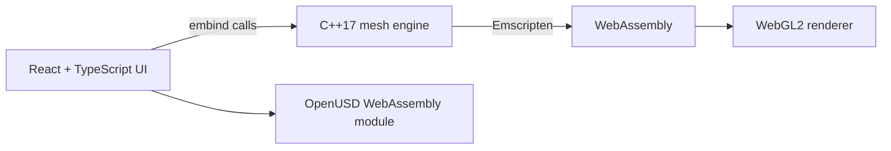

# MeshMaker

<p align="center">
  <strong>A focused 3D mesh editor built since 2009, now running in the browser with C++17, WebAssembly, WebGL2, and React.</strong>
</p>

<p align="center">
  <a href="https://filipkunc.com/meshmaker"><strong>Open the live editor</strong></a>
  ·
  <a href="https://filipkunc.com/posts/meshmaker">Read the story</a>
</p>

<p align="center">
  <a href="https://github.com/filipkunc/MeshMaker/actions/workflows/ci.yml"></a>
  <a href="LICENSE.TXT"></a>
</p>

<p align="center">
  
</p>

MeshMaker is a low-poly modeling tool centered on direct editing of triangle and quad meshes. It began as a native macOS application written in Objective-C++ and C++, later gained a Windows port, and was rebuilt for the web so it can run on any modern platform without installation.

The current editor keeps the modeling engine in C++. Emscripten compiles that engine to WebAssembly, while a React and TypeScript frontend provides the application UI. The same engine can also be built natively against OpenGL 3.3 for fast development and testing.

## Highlights

- Mixed triangle and quad topology, with vertex, edge, face, and object selection
- Extrude, split, merge, triangulate, quadify, transform, duplicate, and delete operations
- Edge loop, ring, grow, and through-selection workflows
- Catmull-Clark and Loop subdivision powered by Pixar's OpenSubdiv
- Box, planar, cylindrical, spherical, and seam-based LSCM UV unwrapping
- Textures, normal maps, and physically based material properties
- Undo and redo across modeling, scene, transform, and material operations
- OBJ, GLB, USDA, USDC, and USDZ import and export
- Monaco-based JavaScript scripting over the WebAssembly API
- Optional image-to-3D and text-to-3D generation with Hunyuan3D-2

## How it works



The React frontend does not own or duplicate mesh data. It calls the C++ engine directly through Emscripten's embind layer and reads back the small amount of state needed to keep the interface synchronized. The engine handles topology, rendering, selection, transforms, UVs, undo and redo, and core file I/O.

The port was deliberately split into two steps: first move the engine into a clean C++17/OpenGL 3.3 build, then compile that same code to WebAssembly and WebGL2. That keeps graphics-porting problems separate from browser-integration problems and gives core algorithms a fast native test target.

## Try it

Open **[filipkunc.com/meshmaker](https://filipkunc.com/meshmaker)** in a browser with WebGL2 support. The editor runs locally in the browser; the optional AI generation feature requires a separate Hunyuan3D-2 server.

Camera controls follow Maya and Unity conventions:

| Action | Mouse |
| --- | --- |
| Rotate | <kbd>Alt</kbd> + left drag |
| Pan | <kbd>Alt</kbd> + middle drag |
| Zoom | <kbd>Alt</kbd> + right drag |

## Build from source

### Prerequisites

- CMake 3.21 or newer
- Ninja
- Clang with C++17 support
- [Emscripten SDK](https://emscripten.org/docs/getting_started/downloads.html)
- Node.js 24 or newer

The C++ dependencies are downloaded by CMake during configuration.

### Web editor

Activate the Emscripten SDK, then build the C++ engine and start the frontend:

```bash
git clone https://github.com/filipkunc/MeshMaker.git
cd MeshMaker/WebGL2

cmake --preset webgl
cmake --build --preset webgl --parallel

cd ../MeshMakerWeb
npm ci
npm run copy-wasm
npm run dev
```

Open the URL printed by Vite, normally <http://localhost:5173>.

The optional OpenUSD module is maintained separately because of its size and build requirements. See [`usd-io/README.md`](usd-io/README.md) for rebuilding it; checked-in release artifacts allow the standard web build to use USD import and export immediately.

### Native engine

The OpenGL 3.3 build is useful for working on the C++ engine without a browser:

```bash
cd WebGL2
cmake --preset desktop-debug
cmake --build --preset desktop-debug --parallel
```

On Linux, install the OpenGL and X11 development packages required by GLFW. For example, Ubuntu uses `libgl1-mesa-dev` and `xorg-dev`.

## Tests

Run the native GoogleTest suite:

```bash
cd WebGL2
ctest --preset desktop-debug
```

Run frontend checks and the Playwright browser suite after building and copying the WebAssembly module:

```bash
cd MeshMakerWeb
npm run lint
npm run build
npx playwright install chromium
npm run test:e2e
```

The Hunyuan3D-2 end-to-end tests require a compatible NVIDIA GPU and a running generation server, so they are excluded from the standard CI browser suite.

## AI 3D generation

MeshMaker can connect to [Hunyuan3D-2](https://github.com/Tencent-Hunyuan/Hunyuan3D-2) for image-to-3D and text-to-3D generation. This is optional and runs as a separate local service; the editor itself does not require Python, CUDA, or model weights.

The included server setup is tested on Windows with an NVIDIA GPU and CUDA. See [`Hunyuan3D-2/README.md`](Hunyuan3D-2/README.md) for model installation and server commands. Once the server is running, use the sparkle button in MeshMaker and configure its URL under **Advanced Options**.

## Project layout

| Path | Purpose |
| --- | --- |
| [`WebGL2/`](WebGL2/) | C++17 engine, OpenGL/WebGL2 renderer, Emscripten bindings, and GoogleTests |
| [`MeshMakerWeb/`](MeshMakerWeb/) | React and TypeScript interface, scripting editor, and Playwright tests |
| [`usd-io/`](usd-io/) | Lazy-loaded OpenUSD WebAssembly module and round-trip tests |
| [`Hunyuan3D-2/`](Hunyuan3D-2/) | Optional AI generation server submodule |
| [`legacy-macos`](https://github.com/filipkunc/MeshMaker/tree/legacy-macos) | Archived pre-WebGL2 application history |

## History

MeshMaker started around 2009 as a way to learn 3D editor development by doing. Its original UI was native Cocoa, with Objective-C++ sharing a C++ modeling core. A C++/CLI and C# Windows port followed. Development slowed around 2015, then resumed with the C++17, WebGL2, WebAssembly, and React port now on `main`.

The longer write-up—covering the porting strategy, C++/JavaScript boundary, OpenSubdiv, automated tests, scripting, and AI-assisted development—is available in **[MeshMaker: the story of the web port](https://filipkunc.com/posts/meshmaker)**.

## License

MeshMaker is available under the [MIT License](LICENSE.TXT). Third-party components, including OpenSubdiv, GLM, GLFW, GLAD, Dear ImGui, GoogleTest, React, Monaco, and Hunyuan3D-2, retain their respective licenses.
